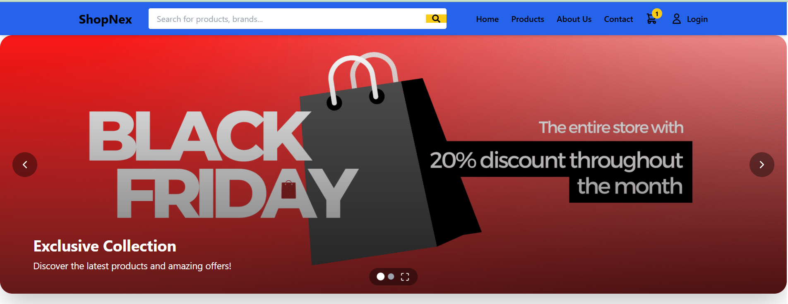
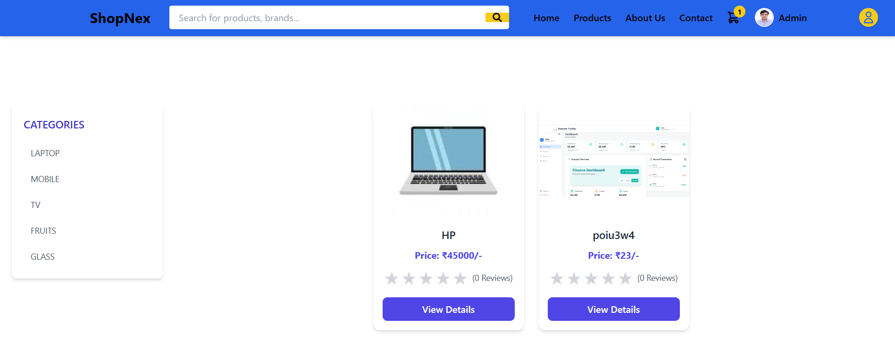
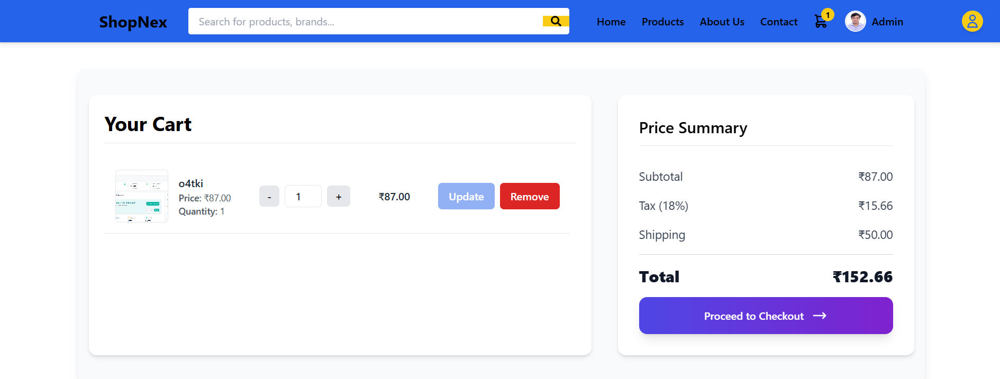
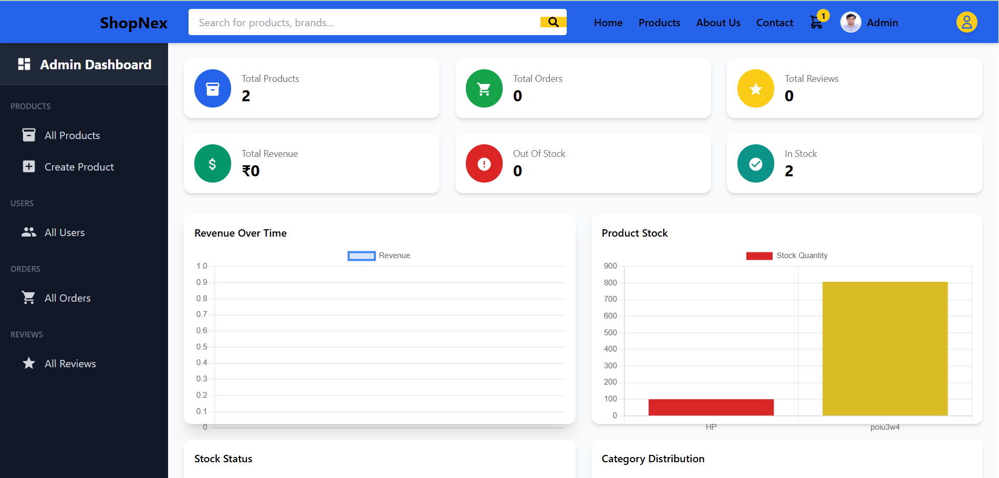

# 🛒 ShopNex — MERN Based E-Commerce Platform

ShopNex is a modern, scalable, and full-stack MERN e-commerce web application designed to deliver a seamless online shopping experience with secure authentication, product management, cart functionality, payment integration, and admin dashboard management.

The project focuses on providing a real-world e-commerce workflow with modern UI/UX, responsive design, reusable architecture, secure backend APIs, and optimized performance using the MERN stack.

---

## 🚀 Live Demo

🌐 https://shop-nex-e-commerce-mern.vercel.app/

---

# 📌 Project Overview

ShopNex simulates a real-world e-commerce platform where users can browse products, search and filter items, manage carts and wishlists, place orders, and complete secure online payments.

The platform also includes an admin dashboard for managing products, categories, and orders efficiently.

This project demonstrates modern full-stack development concepts including:

* RESTful API Architecture
* Authentication & Authorization
* CRUD Operations
* State Management
* Payment Gateway Integration
* Responsive UI Systems
* Backend Security Practices
* Database Management
* Scalable Project Structure

The project was developed with a strong focus on scalability, performance, security, and smooth user experience.

---

# ✨ Key Features

## 👤 User Features

✅ User Registration & Login
✅ JWT Authentication & Authorization
✅ Product Search & Filtering
✅ Category Based Products
✅ Product Details Page
✅ Add to Cart Functionality
✅ Wishlist Management
✅ Quantity Update System
✅ Secure Checkout Process
✅ Online Payment Integration
✅ Order Placement & Tracking
✅ Responsive Mobile-Friendly UI

---

## 👑 Admin Features

✅ Admin Dashboard
✅ Add New Products
✅ Edit Existing Products
✅ Delete Products
✅ Manage Orders
✅ Product Category Management
✅ Backend API Management

---

# 🛠️ Tech Stack

| Layer               | Technology                            |
| ------------------- | ------------------------------------- |
| 🚀 Frontend         | React.js, Redux Toolkit, Tailwind CSS |
| ⚙️ Backend          | Node.js, Express.js                   |
| 🗄️ Database        | MongoDB, Mongoose                     |
| 🔐 Authentication   | JWT, bcrypt.js                        |
| 💳 Payments         | Stripe / Razorpay                     |
| 📡 API Handling     | Axios                                 |
| 🧠 State Management | Redux Toolkit                         |
| ⚡ Build Tool        | Vite                                  |
| 🛠️ Tools           | Nodemon, Git, GitHub                  |

---

# 📂 Project Structure

```bash id="9b2q1l"
ShopNex-E-Commerce-MERN/
│
├── client/
│   ├── src/
│   │   ├── components/
│   │   ├── pages/
│   │   ├── redux/
│   │   ├── assets/
│   │   └── App.jsx
│   │
│   ├── public/
│   └── package.json
│
├── server/
│   ├── controllers/
│   ├── models/
│   ├── routes/
│   ├── middlewares/
│   ├── utils/
│   └── server.js
│
├── package.json
└── README.md
```

---
# 📸 Screenshots










---

# ⚙️ Installation & Setup

## Clone Repository

```bash id="t6pz17"
git clone https://github.com/aman-gupt1/ShopNex-E-Commerce-MERN
```

---

## Navigate to Project Folder

```bash id="qqm5ib"
cd ShopNex-E-Commerce-MERN
```

---

# 🔹 Client Setup

```bash id="jjm4bi"
cd client
npm install
npm run dev
```

---

# 🔹 Server Setup

```bash id="k4s9cu"
cd server
npm install
npm run dev
```

---

# 🔐 Environment Variables

Create a `.env` file inside the server folder and add:

```env id="q0c8qk"
PORT=5000

MONGO_URI=your_mongodb_connection_string

JWT_SECRET=your_jwt_secret_key

STRIPE_SECRET_KEY=your_stripe_secret_key

RAZORPAY_KEY_ID=your_razorpay_key_id

RAZORPAY_KEY_SECRET=your_razorpay_secret
```

---

# 🧭 API Endpoints

| Method | Route                | Description         |
| ------ | -------------------- | ------------------- |
| POST   | /api/auth/register   | Register User       |
| POST   | /api/auth/login      | Login User          |
| GET    | /api/products        | Get All Products    |
| GET    | /api/products/:id    | Get Single Product  |
| POST   | /api/cart            | Add Product To Cart |
| POST   | /api/orders          | Create Order        |
| POST   | /api/payment/process | Payment Processing  |

---

# 💳 Payment Flow

1️⃣ User adds products to cart
2️⃣ User proceeds to checkout
3️⃣ Payment gateway creates payment order
4️⃣ User completes payment securely
5️⃣ Payment verification is processed
6️⃣ Order is successfully placed

---

# 🌐 Deployment

The project can be deployed using:

* Vercel (Frontend)
* Render (Backend)
* MongoDB Atlas (Database)

---

# 📈 Learning Outcomes

Through this project, I improved my understanding of:

* Full Stack MERN Development
* REST API Development
* Authentication & Authorization
* Redux Toolkit State Management
* Payment Gateway Integration
* MongoDB Database Design
* Backend Security Practices
* Responsive Web Design
* Real-World E-Commerce Workflow
* Frontend & Backend Integration

---

# 🤝 Contributing

Contributions are welcome.

1️⃣ Fork the repository
2️⃣ Create a new branch
3️⃣ Make your changes
4️⃣ Submit a Pull Request

---

# 👨‍💻 Developer

**Aman Gupta**
MERN Stack Enthusiast

---

# 📬 Connect With Me

* GitHub: https://github.com/aman-gupt1
* LinkedIn: https://linkedin.com/in/amangupt1
* Portfolio: https://aman-gupt1.github.io/my-portfolio/
* Email: amangupta276302@gmail.com

---

# ⭐ Support

If you like this project, consider giving it a ⭐ on GitHub.

---

# 📄 License

This project is licensed under the MIT License.
